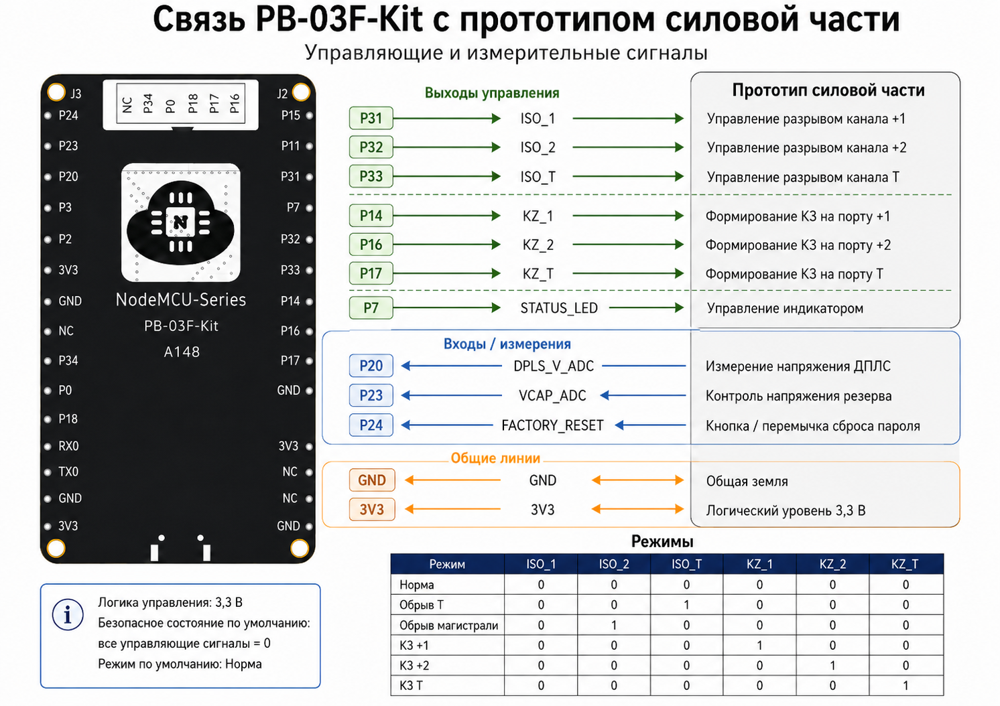

# Test-DPLS 1.2.0

Безопасное BLE-управление испытательным устройством ДПЛС: прошивка PHY6252
(плата PB-03F-Kit), Android- и iOS-клиенты.

Протокол и железо — [Firmware/README.md](Firmware/README.md). Клиенты —
[TestDPLS/README.md](TestDPLS/README.md) и
[TestDPLS-iOS/README.md](TestDPLS-iOS/README.md).

## Что в 1.2.0

- Распиновка revision 2: +1/+2/+Т/резерв (P20/P15/P24/P23), RGB на P7/P11/P18,
  заводской сброс на P34.
- Живые напряжения четырёх каналов в приложении (1 Гц).
- Сон в «Норме», lock сна только на энергизованном режиме, LED без таймера,
  когда гаснет.
- Сборка одним скриптом: Keil/AC6 (релизный образ) и GCC.

## Сборка прошивки

```sh
cmake -S Firmware -B Firmware/build && cmake --build Firmware/build
ctest --test-dir Firmware/build --output-on-failure

tools/build_firmware.sh keil tmp/test-dpls.hex   # Keil MDK Community / AC6
tools/build_firmware.sh gcc  tmp/test-dpls.hex   # GNU Arm Embedded
tools/flash_firmware.sh tmp/test-dpls.hex        # без --erase SNV сохраняется
```

CI (`firmware-target.yml`) собирает оба toolchain.

## Структура

| Каталог | Содержимое |
|---|---|
| `Firmware/` | Ядро сервера (C99) + адаптер PHY62XX SDK 3.1.2 |
| `Firmware/targets/phy6252/` | Keil CMSIS-solution и GCC Makefile |
| `TestDPLS/` | Android (Kotlin, Compose, minSdk 33) |
| `TestDPLS-iOS/` | iPhone (SwiftUI, iOS 16+) |
| `tools/` | Сборка, прошивка, UART, E2E |
| `docs/hardware/` | Схема PB-03F-Kit и распиновка |
| `pvvx-PHY62x2/` | UART-флешер PHY62xx |

## Распиновка



Логика 3,3 В, активный «1». Ноль на всех управляющих выходах — «Норма».

| Функция | GPIO |
|---|---|
| ISO_1 / ISO_2 / ISO_T | P31 / P32 / P33 |
| KZ_1 / KZ_2 / KZ_T | P14 / P16 / P17 |
| ADC +1 / +2 / +Т / резерв | P20 / P15 / P24 / P23 |
| RGB R / G / B | P7 / P11 / P18 |
| Заводской сброс | P34 |

P16/P17 свободны: сборка использует внутренний RC 32 кГц, не кварц.

## Клиенты

```sh
cd TestDPLS && ./gradlew installDebug
open TestDPLS-iOS/TestDPLS.xcodeproj
```

## E2E

```sh
python3 tools/e2e/phone_e2e_test.py
```

Приёмка на железе — [docs/bring-up-checklist.md](docs/bring-up-checklist.md).

## PB-03F-Kit

- **KEY1** отключает питание чипа. Вход в загрузчик: зажать KEY1, запустить
  `flash_firmware.sh`, отпустить на «Turn on the power». RTS/DTR не разведены.
- Заводской сброс пароля — перемычка **P34↔GND** на 5 с. Не ставить на P24
  (это «+Т»). KEY2 кита (P15) занят измерением «+2».
- Watchdog 2 с взводится до OSAL: длинный init кормит `hal_watchdog_feed()`.
